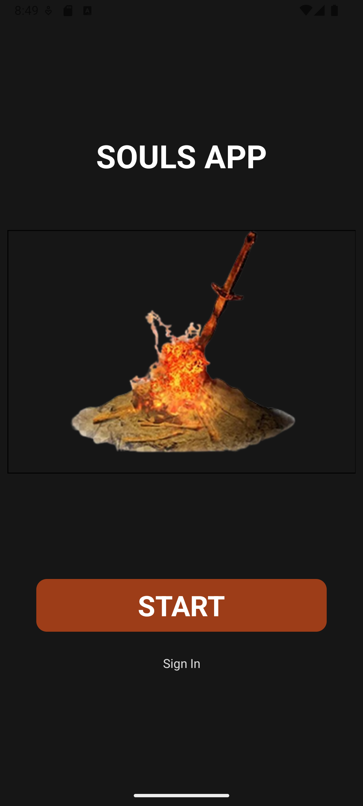

# 📱 React Native Login & Register – Expo + TypeScript

Um projeto simples desenvolvido com **React Native**, **Expo** e **TypeScript**, com o objetivo de praticar conceitos básicos de **componentes**, seus atributos/eventos e introdução ao **Hook `useState`**.  

  

O app possui duas telas principais:  
- **Login** 📝 
- **Cadastro** 🆕  

---

## 🚀 Funcionalidades
- Tela de **Login** com campos de entrada e botão de acesso.  
- Tela de **Cadastro** com campos de entrada para criar uma nova conta.  
- Utilização do **useState** para controle dos inputs.  
- Foco apenas no **frontend** (sem integração com backend)